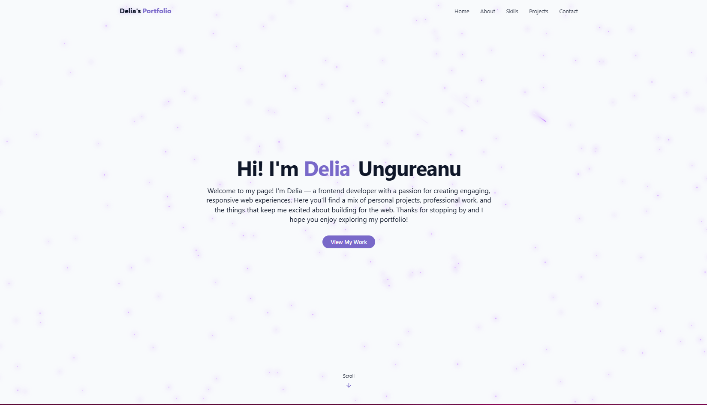

# 🌌 Personal Portfolio Website

This is my personal developer portfolio website, built using **React**, **TypeScript**, **Vite**, and **Tailwind CSS**. It showcases my skills, projects, and contact information with a modern UI and immersive visual effects like dark/light themes, animated stars, meteors, and clouds.



## 🚀 Features

- ✨ Responsive design with dark and light themes
- ⚙️ Built using Vite, React, and TypeScript
- 🎨 Styled with Tailwind CSS and custom animations
- 🌠 Animated starry night background for dark mode
- ☁️ Floating sparkles for light mode
- 📄 Downloadable resume/CV
- 📱 Smooth scrolling and accessible components
- 🛠️ Modular code structure for easy updates

---

## 📁 Project Structure

```

├── public/
│ └── cv.pdf # My downloadable resume
├── src/
│ ├── components/ # Reusable components (Navbar, HeroSection, etc.)
│ ├── pages/ # Home and Not-Found Pages
│ ├── App.tsx
│ └── main.tsx
├── index.css # Global styles with Tailwind theming
├── vite.config.ts
└── README.md

```

---

## 🛠️ Tech Stack

- [React](https://reactjs.org/)
- [TypeScript](https://www.typescriptlang.org/)
- [Vite](https://vitejs.dev/)
- [Tailwind CSS](https://tailwindcss.com/)
- [Lucide Icons](https://lucide.dev/)
- [CSS Custom Properties & Animations](https://developer.mozilla.org/en-US/docs/Web/CSS/Using_CSS_custom_properties)

---

## 🌐 Deployment

This project was deployed using Vercel:

- [Vercel](https://vercel.com/)

at this URL:

- [Delia's Portofolio](https://delia-portofolio.vercel.app/)

---

## 📄 License

This project is licensed under the [MIT License](./LICENSE).

---

## 📬 Contact

Want to get in touch? Reach out via [LinkedIn](https://www.linkedin.com/in/delia-ungureanu-38448b251/) or [email](mailto:deliaungureanu2001@yahoo.com).

---

> Portofolio made by and for Delia-Elena Ungureanu.
